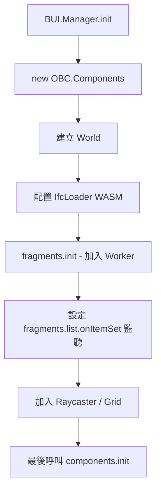

我接下來在updatepage要做的功能是 在第一個步驟時我在uploadIFC.png附加檔案中我用藍色框圈起來的側邊欄位 我叫他模型上傳側邊欄 在那個側邊欄中有收起側邊攔跟展開側邊欄的功能按鍵  下面importing有一個矩形空間 內部寫drop your files here or browse(link) 提供使用者抓取檔案丟進去讀取的功能或是點擊browse字樣 自己在電腦中選取檔案上傳 然後下面會有 loaded model展示已經上傳的檔案 並且依照檔案類型渲染viewer(Viewer3D or PDF viewer) 若是IFC或是frag檔案則背後用 Viewer3D 展示3D模型 若是選擇pdf檔案 則背後用ViewerPDF來展示圖紙內容 並且在點選SidebarUpload裡面的next按鍵時 到下一個步驟 coverselection 提供畫面擷取功能(Cover Selection.png的紅色方框及是擷取範圍) 點擊next後會截取圖片 並將他設為 modelcard的封面 我的3Dviewer中要用thatopen提供的功能來建構 再點擊一次SidebarUpload的next按鈕到最後一步metadata 提供使用者填入檔案的資料 內部有的欄位如metadata.png(在這一步中next按鍵會變成create) 並且將資料傳出去給後端 存到資料庫 請一步一步引導我做出以上功能


Feature: Model Upload and Creation Workflow
  As a user
  I want to upload construction files (IFC, Frag, PDF), capture a cover image, and add metadata
  So that I can store the model in the database and display it on the platform

  Background:
    Given I am on the "Update Page"
    And the "Model Upload Sidebar" (Blue Box) is visible on the left

  # --- 功能模組 1: 側邊欄基礎互動 ---
  Scenario: Toggle Sidebar Visibility
    When I click the "Collapse" button on the sidebar
    Then the sidebar should be hidden or minimized
    When I click the "Expand" button
    Then the sidebar should be fully visible again

  # --- 步驟 1: 檔案上傳與預覽 ---
  Scenario Outline: Upload File and Visualize Content (Step 1)
    Given I am on the "Importing" step
    And I see a drop zone area with text "Drop your files here or browse"
    When I click the "browse" link and select a file "<filename>"
    Or I drag and drop the file "<filename>" into the drop zone
    Then the file should appear in the "Loaded Model" list
    And the main view should render the "<viewer_type>"
    
    Examples:
      | filename       | file_type | viewer_type                                      |
      | structure.ifc  | IFC       | Viewer3D (using That Open Engine)                |
      | building.frag  | Frag      | Viewer3D (using That Open Engine)                |
      | floor_plan.pdf | PDF       | ViewerPDF                                        |

  # --- 步驟 2: 封面截圖 ---
  Scenario: Capture Cover Image (Step 2)
    Given I have successfully loaded a file in Step 1
    When I click the "Next" button in the Sidebar
    Then I should navigate to the "Cover Selection" step
    And I should see a red rectangular frame indicating the capture area
    When I adjust the model view within the red frame
    And I click the "Next" button again
    Then the current view inside the frame should be captured as an image
    And this image should be set as the "Model Card Cover"
    And I should navigate to the "Metadata" step

  # --- 步驟 3: 填寫資料與建立 ---
  Scenario: Fill Metadata and Create Model (Step 3)
    Given I am on the "Metadata" step
    Then the Sidebar action button text should change from "Next" to "Create"
    And I should see input fields for model details (as per Figure 3)
    
    When I fill in the required metadata fields
    And I click the "Create" button
    Then the captured cover image, file, and metadata should be sent to the backend
    And the system should save the entry to the database
    And I should see a success message or be redirected to the model list


upload模型渲染流程圖(mermaid)
sequenceDiagram
    participant U as 使用者 (UI 按鈕)
    participant L as Load Button (邏輯層)
    participant E as That Open Engine (核心)
    participant F as Fragments Manager
    participant S as Three.js Scene
    participant V as Viewport (顯示層)

    U->>L: 點擊上傳並選擇檔案 (.ifc / .frag)
    L->>L: 讀取檔案為 ArrayBuffer
    
    alt 是 IFC 檔案
        L->>E: 調用 IfcLoader.load(buffer)
        E->>E: WASM 引擎解析 IFC 幾何與屬性
        E->>F: 轉換為 Fragments (模型數據)
    else 是 FRAG 檔案
        L->>F: 調用 FragmentsManager.load(buffer)
    end

    F->>F: 建立 FragmentMesh (3D 物件)
    F->>S: 將模型物件加入 Three.js 場景 (Scene)
    F->>E: 觸發 onItemSet 事件
    
    Note over E,V: 渲染循環 (Render Loop) 持續執行中
    
    S->>V: WebGL 渲染更新後的場景
    V-->>U: 使用者在畫面上看到 3D 模型

upload frag ifc file步驟
根據目前專案（`that-open-master`）的成功經驗，我檢查了你的 `Viewer3D.tsx` 程式碼。雖然你的邏輯架構大致正確，但有幾個關鍵的技術細節與原專案不符，這可能會導致渲染失敗、效能低下或功能缺失。

以下是主要的改進建議：

### 1. 缺少 `FragmentsManager` 的初始化 (最關鍵)
在原專案中，`FragmentsManager` 必須指定 **Worker** 的路徑才能正常運作。如果沒有這一步，模型解析（尤其是大型檔案）可能會卡住或報錯。

*   **原專案做法** ([`fragments-manager.ts`](src/bim-components/setup/src/fragments-manager.ts:8)):
    ```typescript
    fragments.init("/node_modules/@thatopen/fragments/dist/Worker/worker.mjs");
    ```
*   **你的程式碼**：完全漏掉了 `fragments.init()`。

### 2. 初始化順序錯誤
在 That Open Engine 中，`components.init()` 應該在**所有組件（Loader, Manager, World）都配置完成後**才呼叫。

*   **你的程式碼**：在第 33 行就呼叫了 `components.init()`，但之後才進行 `world.scene.setup()` 和 `ifcLoader` 的配置。
*   **建議**：將 `components.init()` 移到所有 `setup` 邏輯的最末端（例如 `useEffect` 的最後）。

### 3. 建議使用 `OrthoPerspectiveCamera`
雖然 `SimpleCamera` 可以運作，但原專案使用的是 `OrthoPerspectiveCamera`。這對於 BIM 應用非常重要，因為它支援透視（3D）與正交（2D 平面圖）視角的切換。

*   **原專案做法** ([`create-world.ts`](src/bim-components/setup/src/create-world.ts:29)):
    ```typescript
    world.camera = new OBC.OrthoPerspectiveCamera(components);
    ```

### 4. 渲染容器建議使用 `BUI.Viewport`
你直接將 `containerRef.current` 傳給 `SimpleRenderer`。雖然可行，但原專案使用了 `BUI.Viewport` 組件。這能提供更好的 UI 整合，並自動處理一些複雜的渲染邊界問題。

*   **原專案做法** ([`create-world.ts`](src/bim-components/setup/src/create-world.ts:18)):
    ```typescript
    const viewport = BUI.Component.create<BUI.Viewport>(...);
    world.renderer = new OBC.SimpleRenderer(components, viewport);
    ```

### 5. 缺少 Raycaster 與 Grid (影響互動感)
原專案在建立 World 時會加入 `Raycasters`（用於物件選取）和 `Grids`（地面網格）。少了這些，你的 Viewer 會看起來像是在虛空中，且無法進行後續的物件點擊互動。

*   **原專案做法** ([`create-world.ts`](src/bim-components/setup/src/create-world.ts:44)):
    ```typescript
    components.get(OBC.Raycasters).get(world);
    components.get(OBC.Grids).create(world);
    ```

### 6. 關於 `fragments.core` 的類型轉換
你在程式碼中使用了大量的 `as unknown as ...`。在原專案使用的版本（`~3.1.0`）中，`fragments.core` 是可以直接存取的，不需要這麼複雜的轉換。這暗示你的 `npm` 套件版本可能與原專案不一致，或者類型定義檔沒有正確載入。

### 修正後的建議邏輯流程圖：



### 總結建議：
請務必補上 **`fragments.init()`** 並調整 **`components.init()`** 的執行順序。如果這兩點沒做，上傳 IFC 後很有可能畫面依然是黑的，或者在 Console 出現 `Worker` 相關的錯誤。